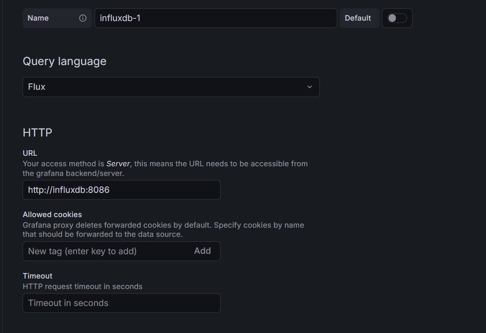
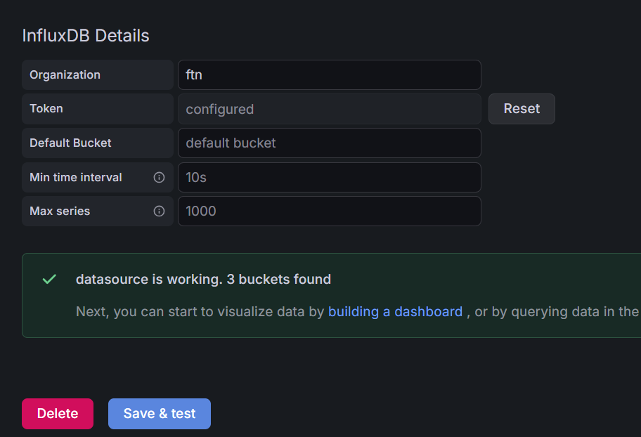
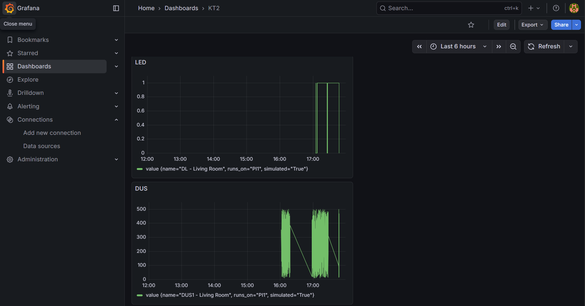

# IoT House Control System

Simulacija kućne automatizacije sa senzorima i aktuatorima. Server prikuplja podatke i šalje ih na InfluxDB putem MQTT-a.

## Zahtevi

- Python 3.8+
- Docker & Docker Compose
- Mosquitto MQTT broker

## Instalacija

```bash
pip install -r requirements.txt
```

## Pokretanje

### 1. Pokreni InfluxDB

```bash
docker-compose up -d
```

Proveri status:
```bash
docker ps
```

### 2. Konfiguriši InfluxDB

1. Otvori http://localhost:8086
2. Kreiraj organizaciju i bucket
3. Kreiraj API token sa pravima za čitanje i pisanje
4. Kopiraj token u `settings.json`:

```json
{
  "influxdb": {
    "url": "http://localhost:8086",
    "token": "TVOJ_TOKEN_OVDE",
    "org": "my-org",
    "bucket": "iot-house"
  }
}
```

### 3. Pokreni Server

```bash
python -m server.server
```

### 4. Pokreni Simulaciju

U novom terminalu:

```bash
python -m simulation.main
```

### 5. Grafana




**MQTT greška:**
```bash
# Instaliraj Mosquitto
mosquitto -v
```

**Token greška:**
- Proveri token u `settings.json` i `.env`
- Proveri org i bucket nazive